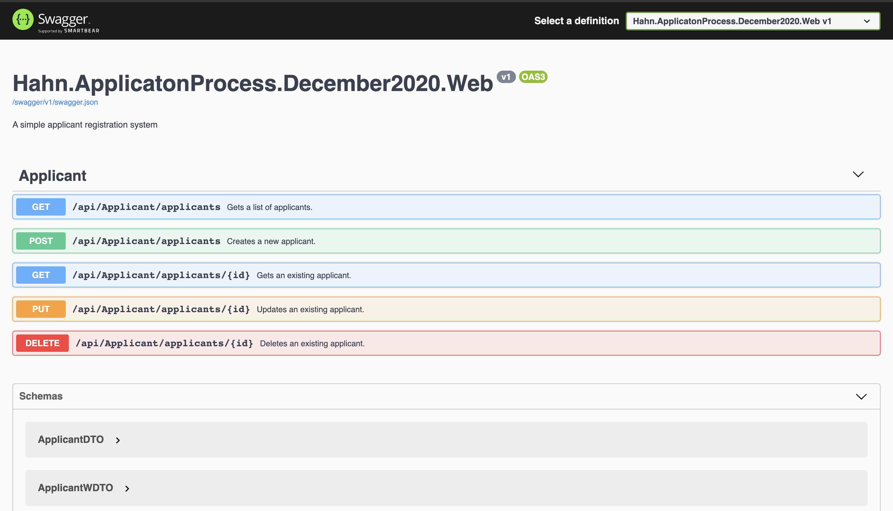

# Hahn.ApplicatonProcess.Application

## What Is This Solution?

This solution is the Hahn.ApplicatonProcess api. It is a localized RESTful service that manages the application process of a job applicant.

## Technology Stack

1. .NetCore
2. EntityFramework Core In-Memory DB
3. EntityFramework Core
4. FluentValidation

### Development Environment Setup

Clone the repository [here](https://github.com/syntiara/Hahn.ApplicatonProcess.Application.git).

1. Open the project in visual studio
2. run dotnet restore to restore package dependencies
3. Click run to start the project
4. The project should open up the browser on https://localhost:5001/swagger/index.html by default

**Database Setup**

The solutions is built with EntityFrameworkCore In-Memory DB
